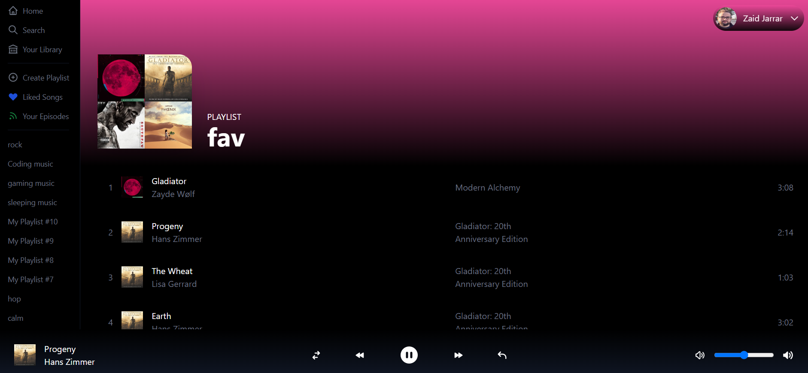
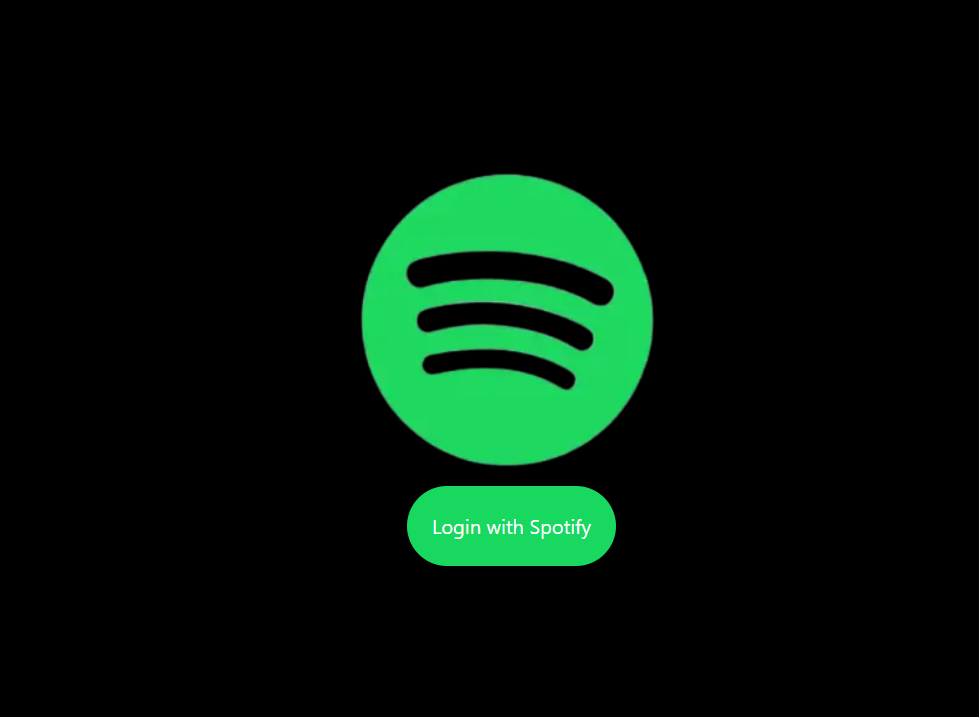

# Spotify-clone

## Features:
- Shows user's Playlists
- Login page
- Sign out
- Songs player
- Volume Controls
- Header Color changes when changing playlists or refresh

### Notes:
- To play and change songs, user must run Spotify in the background and run a song before attempting to do it through here
- Playing songs is only allowed for premium users **Only**
- Next and Previous buttons are still work in progress

## How to use
- Clone the repository
- Run npm install 
- add the information for env file for your spotify dashboard account, ID,secret,jwt key
- Run npm run dev

### Image:

